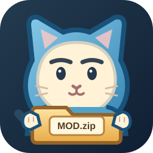

# 呆猫mod manager

给 Windows 版《怪物猎人：世界》《怪物猎人：崛起》《怪物猎人：荒野》管理文件型 Mod。把 ZIP、RAR 或 7Z 拖进窗口，先看它会写到哪里，再决定是否启用。

[下载最新版本](https://github.com/DUSK1NG/daimao-mod-manager/releases/latest) · Windows x64 · 无需另装 .NET 或 7-Zip。

下载 `DaiMaoModManager-Setup.exe`，双击后解压到 `%LOCALAPPDATA%\Programs\DaiMaoModManager`，完成后直接打开程序。也可以下载 ZIP，解压到自己选的文件夹，再运行 `呆猫mod manager.exe`。独立 EXE 可以直接运行。自解压包只放置程序文件；Mod 包、启用记录和备份仍在 `%LOCALAPPDATA%\HunterModManager`。

## 怎么用

1. 关闭游戏，打开程序，选择对应的游戏。检查顶部的游戏目录；如果没有自动找到，点“更改目录”，选择包含游戏 EXE 的文件夹。
2. 拖入压缩包，或点“选择压缩包”。查看安装版本和文件预览。一个包有多个版本时，**点选其中一个版本**，导入按钮才会可用。
3. 点“导入所选版本”。导入只保存压缩包和安装记录，暂时不改游戏文件。
4. 在左侧勾选 Mod 以启用；取消勾选会撤回它的文件，并恢复被它覆盖的原文件。如果它与已启用的 Mod 要写入同一路径，程序会提示你停用冲突 Mod 并切换。

预览提示缺少前置组件时，打开“前置环境”页。World 的 Stracker's Loader 和 Rise 的 FirstNatives 由你下载后选取本地安装包；Rise、Wilds 所用的 REFramework 可以从[官方发布页](https://github.com/praydog/REFramework-nightly/releases/)配置。Wilds 的散文件加载还需要按界面提示检查游戏内设置。

## 支持范围

| 游戏 | 可管理的 Mod 文件 |
| --- | --- |
| 世界 | 目录明确的 `nativePC` 文件 |
| 崛起 | REFramework 脚本、插件；具备散文件加载前置条件时的 `natives` 文件 |
| 荒野 | REFramework 脚本、插件；具备 Loose File Loader 条件时的 `natives` 文件 |

多版本包需要自己选一个版本。无法确定目标目录的普通文件包，可以在“高级选项：手动映射”里指定目录后重新分析。PAK 和独立安装器目前只提示原因，不自动安装，也不会执行压缩包里的程序。

程序按文件记录覆盖前的内容。压缩包、状态和备份放在 `%LOCALAPPDATA%\HunterModManager`；如果游戏文件在工具之外被改过，启停操作会停下并保留现场。文件复制成功仍需进游戏确认 Mod 实际生效。目前的自动测试使用模拟游戏目录，尚未完成游戏内加载验证。

## 从源码构建

开发需要 Windows x64、.NET 10 SDK、7-Zip 和 [NSIS 3.11](https://sourceforge.net/projects/nsis/files/NSIS%203/3.11/nsis-3.11.zip/download)。将 NSIS 的 ZIP 解压到 `artifacts/tools/nsis`，得到 `nsis-3.11/makensis.exe`。构建便携 EXE、ZIP 和自解压包：

```powershell
.\scripts\build-release.ps1
```

打包后从根目录 `bin\呆猫mod manager.exe` 启动。`bin` 是指向 `artifacts/publish` 下最新程序的目录联接；下载包在 `artifacts/package`。以后打包会自动更新入口。各源码项目自己的 `bin`、`obj` 仍用于编译，完整说明见[目录约定](docs/directory-layout.md)。

核心集成测试使用临时游戏目录，不写入真实安装目录：

```powershell
dotnet run --project tests/HunterModManager.Tests/HunterModManager.Tests.csproj -c Release
dotnet run --project tests/HunterModManager.WpfLayoutTests/HunterModManager.WpfLayoutTests.csproj -c Release
```

测试本机 RAR 或多版本 ZIP 时，可分别设置 `HMM_RAR_FIXTURE`、`HMM_MULTIVARIANT_FIXTURE` 为样本的完整路径。发布包中的 7-Zip 组件许可见 [THIRD-PARTY-NOTICES.md](THIRD-PARTY-NOTICES.md)。本工具是非官方作品，与 Capcom 无关联。
